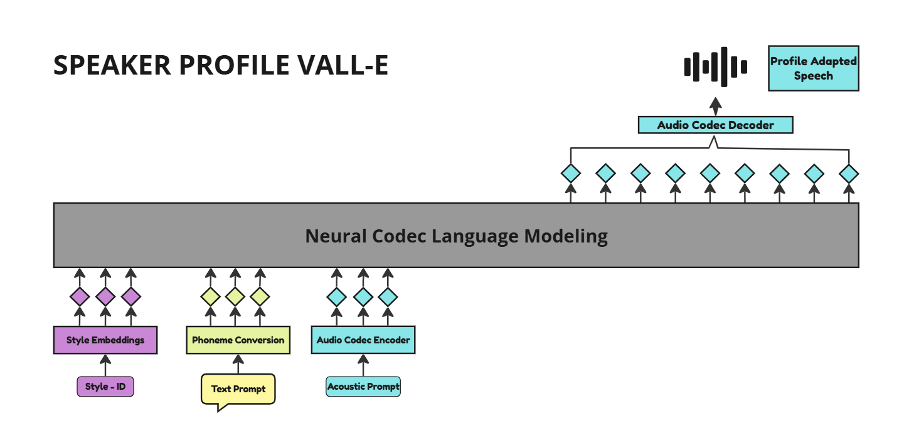

#  Speaker Profile VALL-E



## Overview

**Profile VALL-E** is a project focused on implementing and extending the VALL-E Text-to-Speech (TTS) model. This project aims to explore speaker profile-based TTS, allowing the generation of speech that reflects unique speaker characteristics like gender, accent and age.

## Setup

1. **Clone the repository**:
    ```bash
    git clone https://github.com/anilpudasaini/Profile-VALL-E.git
    cd Profile-VALL-E
    ```

2. **Install Dependencies**:
    ```bash
    pip install -r requirements.txt
    ```

## Goals

This project will be extended to include:

- [x] Implementation of VALL-E
- [x] Include speaker profile attributes for personalized TTS
- [ ] Add profile prompting for style control

## Style IDs and Training Data

The VALL-E model in this project supports various speaker styles, identified by unique style IDs. Below is a mapping of some of the styles included in this project:

```python
style_id_mapping = {
    ("young", "male", "american"): 0,
    ("adult", "male", "american"): 1,
    ("young", "female", "american"): 3,
    ("adult", "female", "american"): 4,
    ("young", "male", "indian"): 6,
    ("adult", "female", "indian"): 9,
    ("young", "male", "british"): 13,
    ("adult", "male", "british"): 14,
    ("adult", "male", "canadian"): 20,
}
```

## Audio Samples

Here are some samples generated using the VALL-E model:

<table>
  <tr>
    <td align="center">
      <strong>Sample 1</strong>
      <br><br>
      [Click to Play Sample 1](https://github.com/anilpudasaini/Profile-VALL-E/raw/main/sample_audios/0_style_id_9.wav)
      <br><br>
      Style_id = 9<br>
      "Today is a beautiful day and I hope you are feeling great"
    </td>
    <td align="center">
      <strong>Sample 2</strong>
      <br><br>
      [Click to Play Sample 2](https://github.com/anilpudasaini/Profile-VALL-E/raw/main/sample_audios/0_style_id_4.wav)
      <br><br>
      Style_id = 4<br>
      "Paris is known for its Eiffel Tower."
    </td>
  </tr>
  <tr>
    <td align="center">
      <strong>Sample 3</strong>
      <br><br>
      [Click to Play Sample 3](https://github.com/anilpudasaini/Profile-VALL-E/raw/main/sample_audios/2_style_id_20.wav)
      <br><br>
      Style_id = 20<br>
      "Ice-cream is sweet and cold."
    </td>
    <td align="center">
      <strong>Sample 4</strong>
      <br><br>
      [Click to Play Sample 4](https://github.com/anilpudasaini/Profile-VALL-E/raw/main/sample_audios/3_style_id_14.wav)
      <br><br>
      Style_id = 14<br>
      "I love my partner and I hope she loves me."
    </td>
  </tr>
  <tr>
    <td align="center" colspan="2">
      <strong>Sample 5</strong>
      <br><br>
      [Click to Play Sample 5](https://github.com/anilpudasaini/Profile-VALL-E/raw/main/sample_audios/5_style_id_1.wav)
      <br><br>
      Style_id = 1<br>
      "Earth orbits around the sun and rotates on its axis."
    </td>
  </tr>
</table>

## Training Data
While other models like Microsoft's VALL-E and ChatTTS have been trained on extensive datasets (60k and 100k hours respectively), the audios were generated by a version of the model trained on 274 hours of audio from the selected styles. This focused dataset allows for efficient training while still capturing diverse speaker characteristics. However, with an increased dataset, the audio quality is expected to improve further, providing even more natural and expressive speech synthesis.


Stay tuned for further updates!

