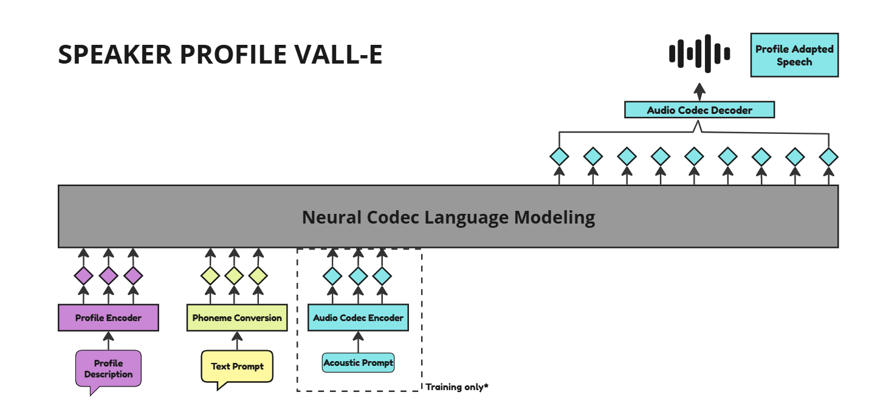

#  Speaker Profile VALL-E



## Overview

**Profile VALL-E** is a project focused on implementing and extending the VALL-E Text-to-Speech (TTS) model. This project aims to explore speaker profile-based TTS, allowing the generation of speech that reflects unique speaker characteristics like accent and age.

## Setup

1. **Clone the repository**:
    ```bash
    git clone https://github.com/anilpudasaini/Profile-VALL-E.git
    cd Profile-VALL-E
    ```

2. **Install Dependencies**:
    ```bash
    pip install -r requirements.txt
    ```

## Goals

This project will be extended to include:
- Implementation of VALL-E
- Experimentation with speaker profile attributes for personalized TTS

---

Stay tuned for further updates!

